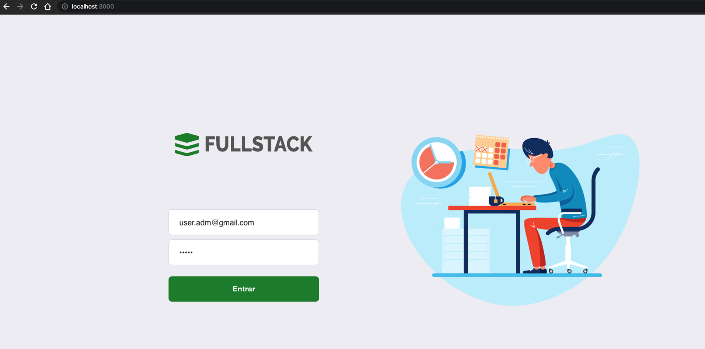
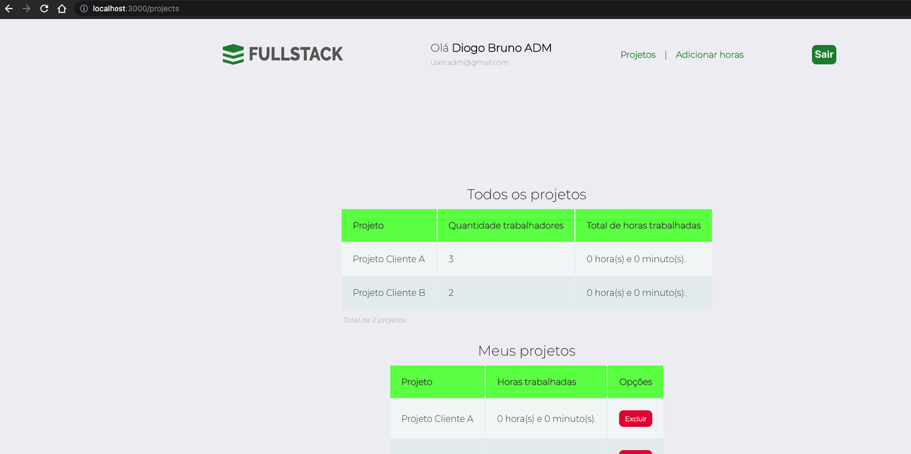
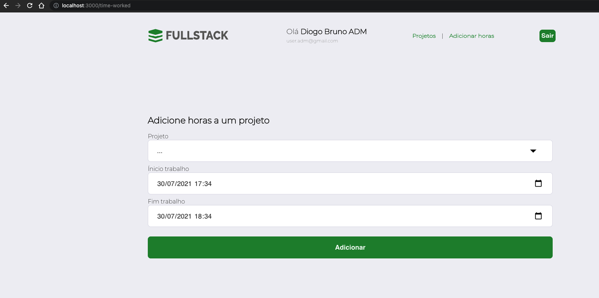
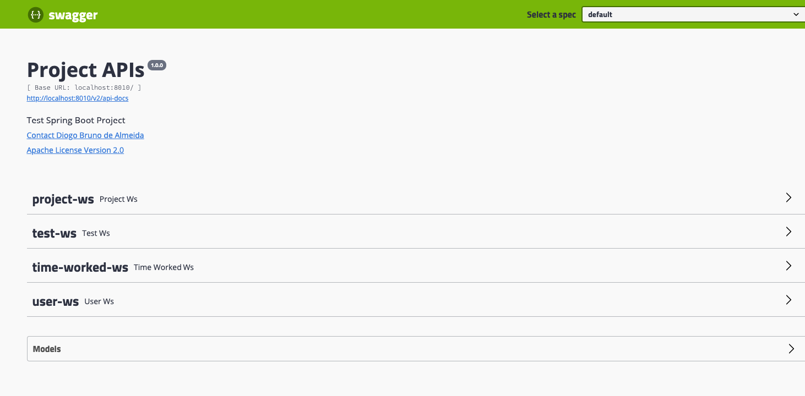
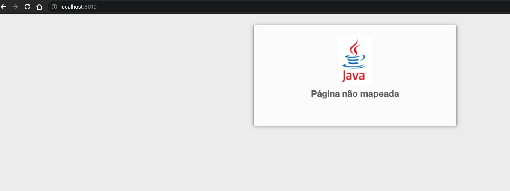

# Project - Fullstack

## Main Technologies Used


## Start Project

```bash
git clone https://github.com/diogo-bruno/docker-java-spring-react-challenge.git
cd docker-java-spring-react-challenge
docker-compose up
```

## Urls Project

- http://localhost:3000 - React / Front
- http://localhost:8010 - Java / Back
- http://localhost:3306 - Mysql / DataBase
- http://localhost:8080 - Adminer / Client DB

## Swagger APIs

- http://localhost:8010/swagger-ui.html

## Start Data Test

- http://localhost:8010/reset-and-create-data-test

## User ADM Login

- email: user.adm@gmail.com
- password: admin

## Screenshots

### Login



### Home


### Projects



### Add Time Worked



### Swagger



### Spring Custom Page Error



### Spring Security


# Contact
- diogo.bruno2@gmail.com
- https://www.linkedin.com/in/diogobrunoalmeida/